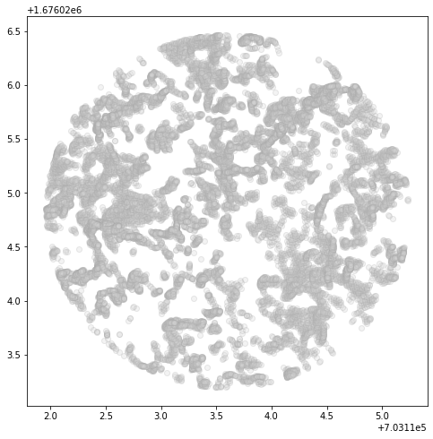
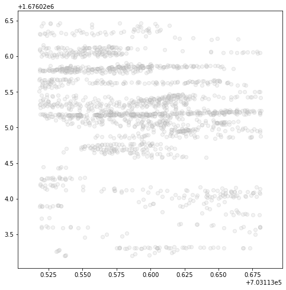
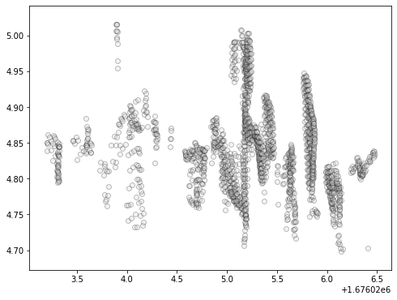
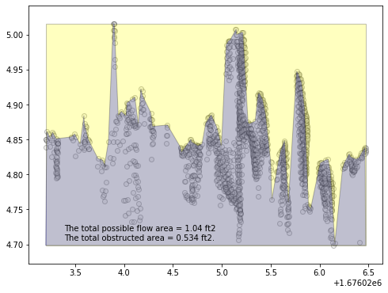

This is the process document for manually geolocating the oyster reef scans based on the general scanner position GPS data.  
Prior to starting this notebook, we produced an ASCII text point cloud by clipping then exporting from FARO SCENE, the software associated with the laser scanner we used.


```python
import pandas as pd
import numpy as np
import subprocess
import matplotlib.pyplot as plt
from matplotlib.patches import Polygon
import time
%matplotlib inline
```

We will begin by importing the laser scan data in ASCII text format. These data are arranged in comma separated columns: x,y,z,r,g,b.  
Note that at this point, the xyz coordinates are local to the cluster of registered scans.


```python
# raw data is in meters
df = pd.read_csv('Live4.txt',
                 sep=' ',
                 header=None,
                 names=['x','y','z','red','green','blue'],
                 usecols=['x','y','z'],
                 dtype=np.float64)
df = df/0.3048 # convert to feet
```

Since the coordinates are local, we must georeference them by hand. The general workflow is:
1. Take a random sample of the points and export them to an AutoCAD compatible file (coordinates only).
2. Import the points into AutoCAD using the "Points from File" command and selecting the sample points file.
3. Draw a circle envelope around the points with the center at the origin (0,0). This will act as a reference anchor point.
4. Import a georeferenced aerial image (downloaded from FDOT) into the CAD drawing file. You may need to override the coordinate system to NAD83(2011) FL State Plane East feet.
5. Move the point cloud, using the reference anchor as a base, and line it up as well as possible with the reef in the aerial image.
6. The new coordinates of the reference anchor are the spatial offset values for the point cloud.


```python
output_filename = f'Live4_ft_sample_GeoRef_{str(time.ctime())}.txt'
print(output_filename)
```

    Live4_ft_sample_GeoRef_Thu Oct 31 09:59:06 2019.txt


Choose a set points at random. The sample needs to be large enough to generate a point cloud sufficient to visually match it up with the oyster reef in the aerial photo.

Also, we implement an initial offset to place the sample points near the georeferenced aerial image in AutoCAD. This makes zooming and moving the sample points easier.

Future: Use a convex hull algorithm to make this a polygon, it will be much lighter in AutoCAD making it easier to manipulate the shape when aligning it with the oyster reef in the image.


```python
df_sample = df.sample(5000)
prelim_x_offset = 700000.124999993597157
prelim_y_offset = 1679999.875000762986019
df_sample['x'] = df_sample['x'] + prelim_x_offset
df_sample['y'] = df_sample['y'] + prelim_y_offset
df_sample.head()
print(len(df_sample))
```

    5000


Write the list of sample points to csv file.


```python
df_sample.to_csv(output_filename, header=False, index=False)
```

Reference aerial photo downloaded from FDOT APLUS service at  

https://fdotewp1.dot.state.fl.us/AerialPhotoLookUpSystem/  

into the AutoCAD drawing. Then import the sample points. Place a shape (I use a circle) centered on the preliminary offset from above. The center of this circle provides an origin from which the sample points can be moved and referenced.

Once the points are in the drawing and appear correct, select all the points and the reference circle and line them up with the oyster reef in the aerial. Once the points are located, list the coordinates of the center of the circle. These are the new offset values to apply to the complete dataset.


```python
# X=703074.5288  Y=1676051.8366 from AutoCAD list properties command "li"
# 703074.5288,1676051.8366

new_origin_x = 703074.5288
new_origin_y = 1676051.8366
new_origin_z = df.iloc[:,2].min()*(-1) # make all z coordinates positive
```


```python
df = df.add([new_origin_x,new_origin_y,new_origin_z],axis='columns')
```

Now we incorporate the position of the Vectrino instrument. This was derived from the raw GPS files acquired by DS and provided by VK. The GPS data were acquired in NAD83(2011) FL State Plane East meters.


```python
vectrino_position_x_m = 214309.0252
vectrino_position_y_m = 510852.3690
vectrino_position_x_ft = vectrino_position_x_m / 0.3048 # convert to feet
vectrino_position_y_ft = vectrino_position_y_m / 0.3048 # convert to feet
```

In order to get a sample of scan points around the vectrino position, we compute the x and y distances from each point in the complete scan and add them as new fields.


```python
df['x_diff'] = df['x'] - vectrino_position_x_ft
df['y_diff'] = df['y'] - vectrino_position_y_ft
```

Next, we calculate the distance from each point in the complete scan to the vectrino and place it into a new field for each point named "rv" for "radius to vectrino."


```python
df['rv'] = np.sqrt(df['x_diff']**2 + df['y_diff']**2)
```

As a check, we examine the minimum radius to vectrino to ensure that it is small. With the large number of points in the complete scan, there is a high probability that one of the points is very close to the vectrino position.


```python
df['rv'].min()
```


    0.006824043062471545


Now we create a new dataframe containing all points in the complete scan with a radius to vectrino less than 0.5 meters. This will produce a circular sample with a 1 meter diameter centered on the vectrino position.


```python
r_samp = 0.5 # meters
df_vectrino = df[df.rv < r_samp/0.3048]
```


```python
print(f'There are {len(df_vectrino)} points within {r_samp} meter of the vectrino')
```

    There are 24460 points within 0.5 meter of the vectrino


Generate a test visual of the vectrino point sample.


```python
fig, ax = plt.subplots(figsize=[8,8])
ax.scatter(df_vectrino['x'],df_vectrino['y'],alpha=0.25,color='lightgray',edgecolors='darkgray');
```





As a test, I will extract a 5 cm wide vertical slice from the sample.


```python
# 5 cm slice x 1 in / 2.54 cm * 1 ft / 12 in
slice_width = 5.0 / 2.54 / 12.0
df_vectrino_NS = df_vectrino[df_vectrino.x > (vectrino_position_x_ft - slice_width/2.0)]
df_vectrino_NS = df_vectrino_NS[df_vectrino_NS.x < (vectrino_position_x_ft + slice_width/2.0)]
```

We will plot it again to check that it looks reasonable. Note that the axes are scaled in such a way that the point density is smeared over a larger area than reality.


```python
fig, ax = plt.subplots(figsize=[8,8])
ax.scatter(df_vectrino_NS['x'],df_vectrino_NS['y'],alpha=0.25,color='lightgray',edgecolors='darkgray');
```





Next we will plot the points in cross-section. This is the view that the flow would "see."


```python
fig, ax = plt.subplots(figsize=[8,6])
ax.scatter(df_vectrino_NS['y'],df_vectrino_NS['z'],alpha=0.25,color='lightgray',edgecolors='black')
```


    <matplotlib.collections.PathCollection at 0x7febf007dbd0>





This is the dataset we will use to compute solid volume fraction (SVF). First, I will establish the outer bounding box that will serve as a proxy for total possible flow area. Then I will wrap the points themselves in a polygon such that the base area is preserved and the upper area is snapped to the oyster surface. The ratio of these areas will be the SVF.


```python
y_max = df_vectrino_NS['y'].max()
y_min = df_vectrino_NS['y'].min()
z_max = df_vectrino_NS['z'].max()
z_min = df_vectrino_NS['z'].min()

total_flow_area = (y_max - y_min) * (z_max - z_min)

tf_vertices = [(y_min,z_min),(y_max,z_min),(y_max,z_max),(y_min,z_max)]
```

Now that the total flow area, and its associated polygon patch for plotting, are complete, we must bound the highly irregular upper surface of the oyster reef. Approaches like convex hull are highly parameter dependent so for simplicity I will use a simple moving window, essentially choosing the point with the highest z value in each bin.

First, we establish the lower boundary of this area by explicitly establishing the left most, right most, lower right, and lower left points.


```python
resolution = 100 # how many bins in the y direction
bounds = np.linspace(y_min,y_max,num=resolution,endpoint=True)

left_point = df_vectrino_NS[df_vectrino_NS.y == y_min]
right_point = df_vectrino_NS[df_vectrino_NS.y == y_max]
ll_point = left_point
ll_point.loc[:, 'z'] = z_min
lr_point = right_point
lr_point.loc[:,'z'] = z_min
```

    /Users/medeiros/anaconda3/envs/oyster_env/lib/python3.7/site-packages/pandas/core/indexing.py:576: SettingWithCopyWarning: 
    A value is trying to be set on a copy of a slice from a DataFrame.
    Try using .loc[row_indexer,col_indexer] = value instead
    
    See the caveats in the documentation: http://pandas.pydata.org/pandas-docs/stable/user_guide/indexing.html#returning-a-view-versus-a-copy
      self.obj[item_labels[indexer[info_axis]]] = value


```python
tips = pd.DataFrame(left_point)

for i in range(len(bounds)-1):
    top_vertex = df_vectrino_NS[df_vectrino_NS.y < bounds[i+1]]
    top_vertex = top_vertex[top_vertex.y > bounds[i]]
    tips = pd.concat([tips,top_vertex[top_vertex.z == top_vertex['z'].max()]],ignore_index=True)

tips = pd.concat([tips,right_point,lr_point,ll_point],ignore_index=True)

tip_vertices = [(y,z) for y,z in zip(tips['y'],tips['z'])]
```

To calculate the area of the obsructed polygon, we employ the "Shoelace Formula"


```python
def PolygonArea(corners):
    n = len(corners) # of corners
    area = 0.0
    for i in range(n):
        j = (i + 1) % n
        area += corners[i][0] * corners[j][1]
        area -= corners[j][0] * corners[i][1]
    area = abs(area) / 2.0
    return area

obstructed_area = PolygonArea(tip_vertices)
```


```python
fig, ax = plt.subplots(figsize=[8,6])

poly = Polygon(tf_vertices, facecolor='yellow', edgecolor='black', alpha=0.25)
poly2 = Polygon(tip_vertices, facecolor='blue', edgecolor='black', alpha=0.25)
ax.add_patch(poly)
ax.add_patch(poly2)
ax.scatter(df_vectrino_NS['y'],df_vectrino_NS['z'],alpha=0.25,color='lightgray',edgecolors='black')
ax.text(0.1,0.1,
        f'The total possible flow area = {np.round(total_flow_area,3)} ft2\n\
The total obstructed area = {np.round(obstructed_area,3)} ft2.\n',
        horizontalalignment='left',
        verticalalignment='center',
        transform=ax.transAxes);
```





```python
print(f'The solid volume fraction (SVF) of this slice of oyster reef is {np.round(obstructed_area/total_flow_area,3)}')
```

    The solid volume fraction (SVF) of this slice of oyster reef is 0.514

